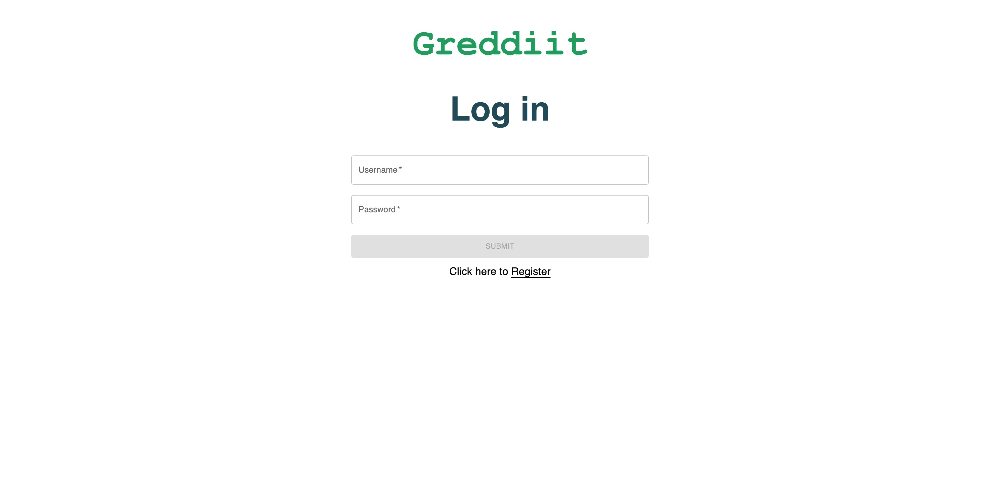
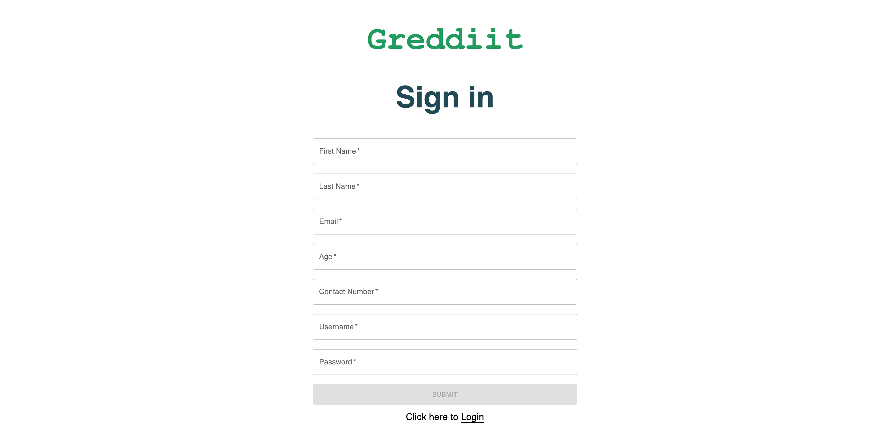
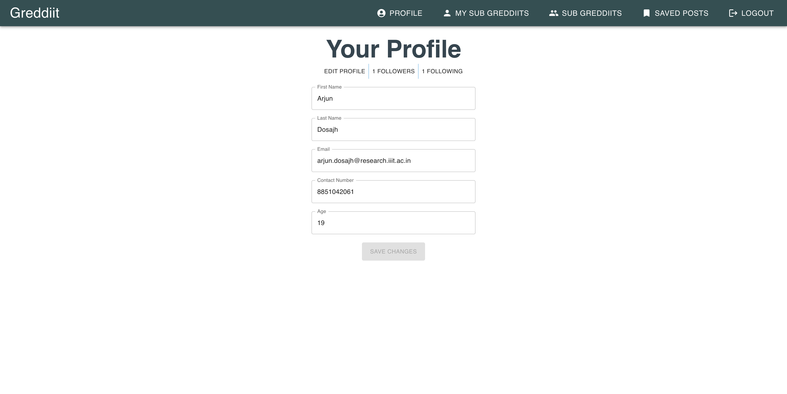
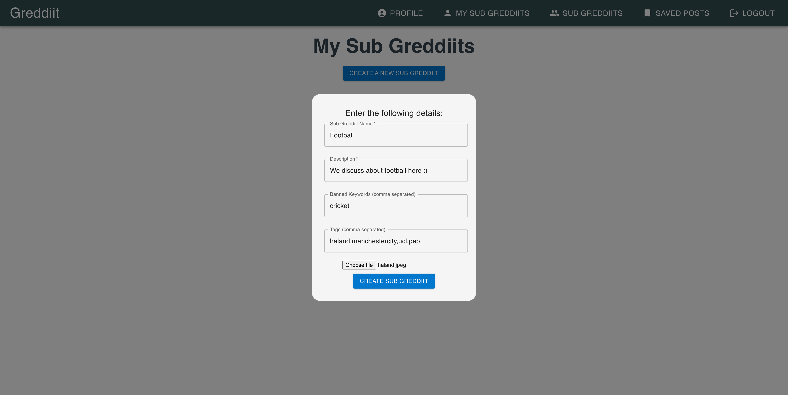
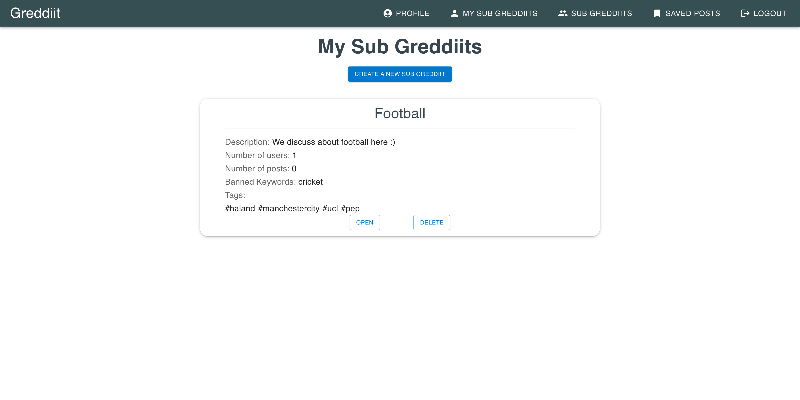
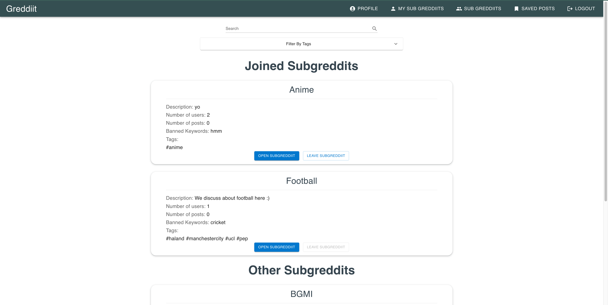
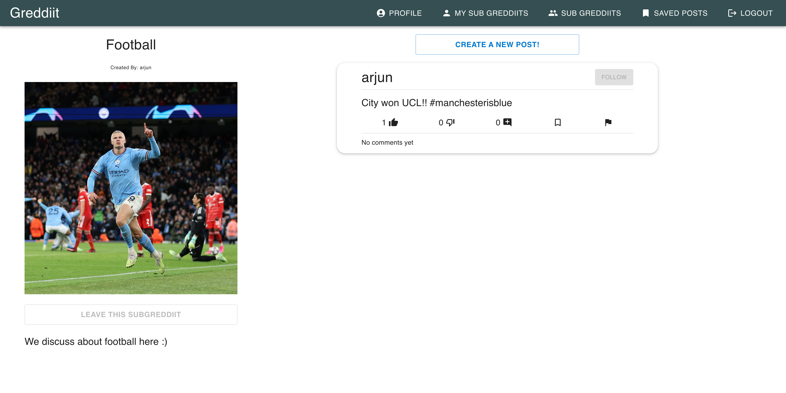
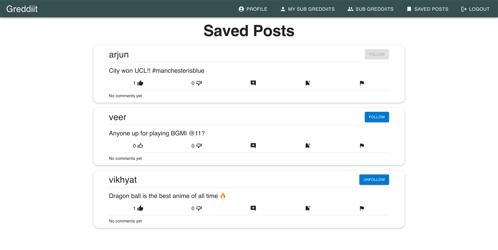
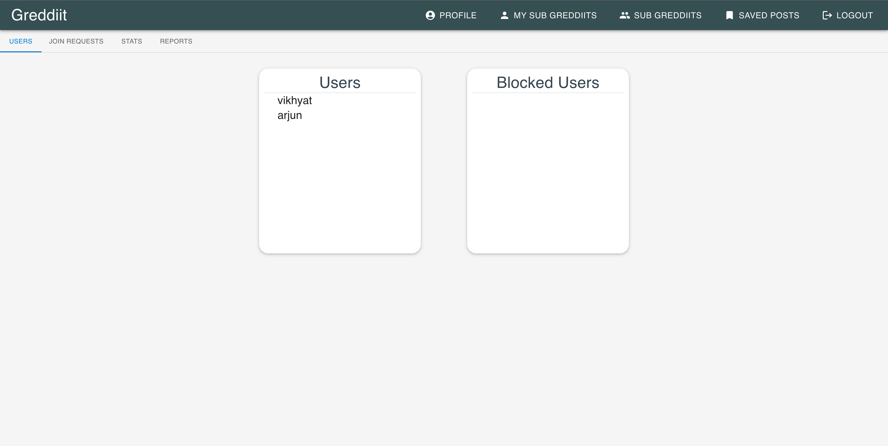
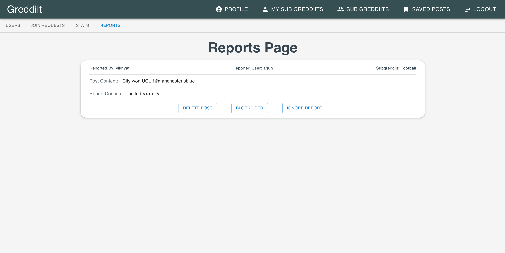

# GredIIT - A Social Media Platform

---



GredIIT is a social media platform based on the MERN stack with a user interface designed using MUI (Material-UI). It draws inspiration from the original Reddit and shares many similarities with it.

All the data is stored in MongoDB cloud. To connect your own MongoDB URI, update the URI in the backend folder's `.env` file.

## Features

- **Posting and Sharing Content:** Users can create and share posts, images, and links with the community.

- **Upvoting and Downvoting:** Similar to Reddit, users can express their approval or disapproval of posts and comments through upvotes and downvotes.

- **Commenting:** Users can engage in discussions by leaving comments on posts.

- **Subreddits or Categories:** GredIIT allows users to categorize content into different subreddits, making it easier to find relevant posts.

- **User Profiles:** Each user has a profile that showcases their posts and activities on the platform.


## How to run the app?

Clone the github repo using this command
```
git clone https://github.com/ArjunDosajh/Greddiit.git
```

From the root directory of the project, run the following command to install all the dependencies
```
npm install
```

To run the the frontend and backend together, run the following command
```
npm run dev
```

> To run the docker container, run the following command
```
docker-compose up
```

## Some features of the app are listed below:
* Register page



> When the user logs in or creates a new account, a jwt (json web token) is generated and stored in the local storage of the browser. This token is used to authenticate the user and to keep them logged in.

* Profile Page



> The profile page shows the user's details and their followrs and following. The user can also edit their details here and by clicking on save, the details are updated in the database.

* My SubGredIITs page



> The user can create their own subgreddiit from this page, and can also view the subgreddiits they have created.



* All Subgreddiits page



> * Here the user can see all the subgreddiits in 2 sections, the first section shows the subgreddiits the user has joined and the second section shows all the subgreddiits.
> * The user can join a subgreddiit by clicking on the join button.
> * The user can also search for a subgreddiit by typing in the search bar and filter subgreddits by toggling the tags.

* Page of a subgreddiit



> In the subgreddiit page, the user can see all the posts in that subgreddiit. The user can also create a post by clicking on the create post button. Also, there are options to `like`, `dislike`, `comment` and `report` a post. The user can also `save` the post by clicking on the bookmark icon!

* Saved Posts Page



> The user can see all the posts they have saved in this page.

* SubGreddiit Admin Page



> On this page the user has controls to accept or deny join requests made by anyone on their subgreddiit.

* Subgreddiit Reports Page



> On this page the user can see all the reports made on posts on their subgreddiit and can take actions on them. In the example show above, the admin is obviously going to ignore the report!

